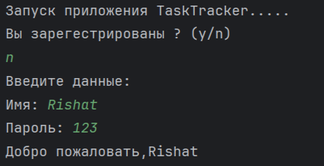
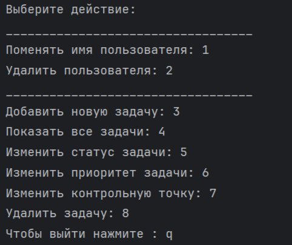
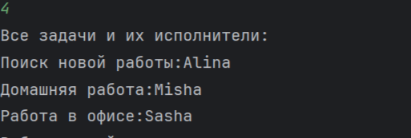
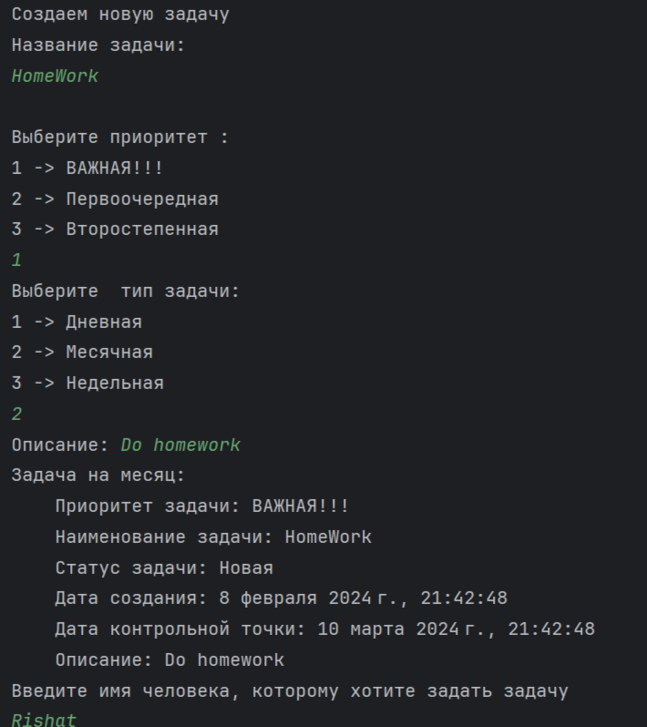

# Develonika
Тестовое задание (Консольное приложение Трекер Задач)

<h2>Тех. Задание</h2>  
Вам необходимо создать консольное приложение для управления списком задач. Приложение должно предоставлять следующий функционал:

1. Добавление новой задачи.
2. Просмотр списка задач.
3. Отметка задачи как выполненной.
4. Удаление задачи.
5. Выход из приложения.
___________________________________

<h2>Пример работы</h2>

